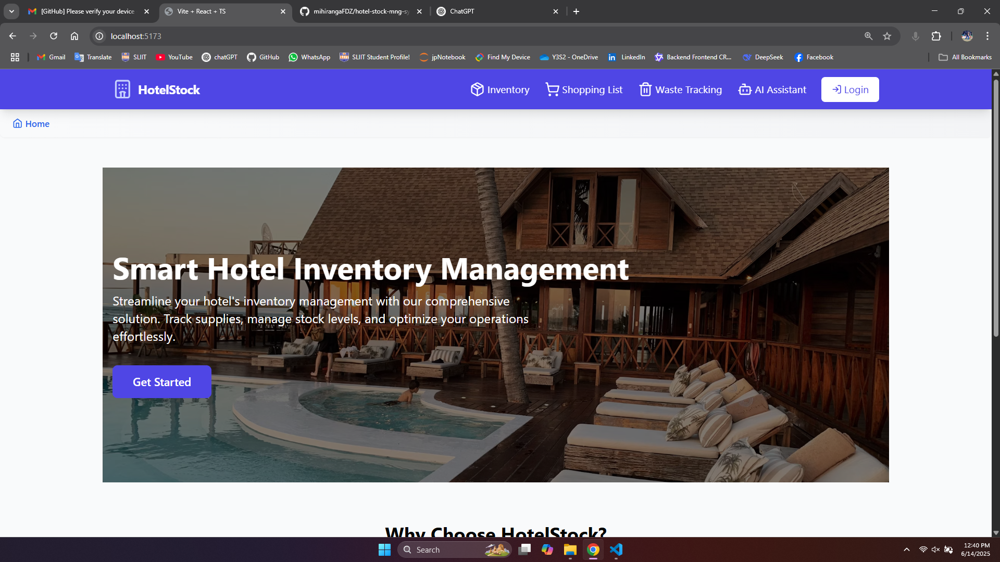
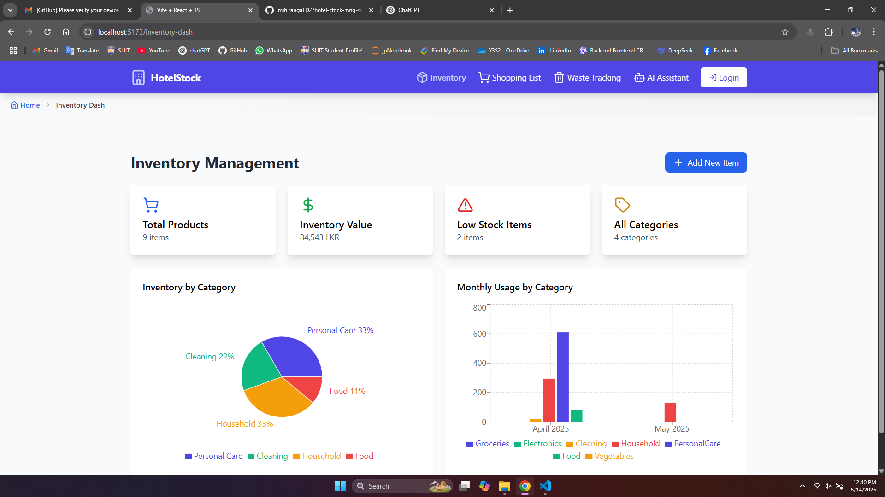
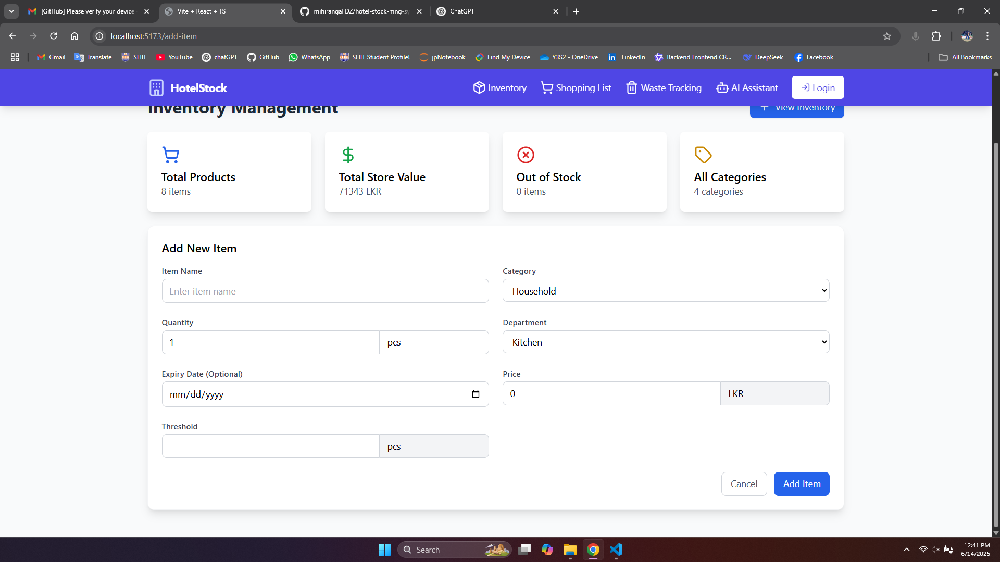

# 🏨 Hotel Stock Management System

A modern full-stack web application built with the **MERN Stack (MongoDB, Express.js, React, Node.js)** to help hotels efficiently manage their inventory, reduce waste, automate shopping, and get instant insights with AI support.

## 🚀 Project Overview

Managing hotel stock can be complex — from tracking inventory across departments to avoiding unnecessary waste or missed orders. This project simplifies the process with **intelligent automation**, designed for real-world hotel operations.

---

## 🔥 Key Features

- 📦 **Inventory Management**
  - Add, update, and remove stock items.
  - Track quantity, categories, expiry, and storage location.
  
- 🧠 **Smart Shopping List**
  - Auto-generates shopping lists based on stock levels, usage patterns, and thresholds.
  - Prevents over-ordering or running out of critical items.

- 🗑️ **Waste Tracking**
  - Log and monitor wasted items with reason codes.
  - Analyze patterns to improve efficiency and reduce loss.

- 🤖 **AI Assistant Bot**
  - Chat-based assistant for quick queries like:
    - “What items are low?”
    - “What was wasted last week?”
    - “Suggest a reorder list.”
  - Integrated using basic NLP techniques and rule-based logic.

---
## 🛠️ Tech Stack

| Frontend |  Backend  | Database |         Other       |
|----------|-----------|----------|---------------------|
| React.js | Node.js   | MongoDB  | JWT, Bcrypt         |
| Axios    | Express   | Mongoose |  Bot Logic (for AI) |
| Tailwind |           |          |  REST API           |

## 📸 Screenshots

| Dashboard | Inventory List | Add Item Form |
|----------|----------------|----------------|
|  |  |  |

## 🧑‍💻 How to Run Locally

### 1. Clone the Repository

git clone https://github.com/mihirangaFDZ/hotel-stock-mng-system.git
cd hotel-stock-mng-system
### 2. Set Up Backend

cd backend
npm install
Create a .env file in the /backend directory with the following:

PORT=5000
MONGO_URI=your_mongodb_connection_string
JWT_SECRET=your_secret_key

npm run dev
### 3. Set Up Frontend

cd frontend
npm install
npm start
Visit http://localhost:3000 to view the app.

🧪 Test Credentials

Admin Login:
Email: admin@hotel.com
Password: admin123
📌 Folder Structure

hotel-stock-mng-system/ 
├── backend/ 
│   ├── controllers/        
│   ├── models/             
│   ├── routes/             
│   ├── middleware/         
│   │   └── auth.js         
│   ├── utils/              
│   └── server.js          
├── frontend/ 
│   ├── components/         
│   ├── pages/              
│   ├── services/          
│   └── App.js            
└── README.md

## 👥 Contributors

| Name | Role | GitHub |
|------|------|--------|
| **Mihiranga Fernando** | Full-Stack Developer / Project Lead | [@mihirangafdz](https://github.com/mihirangafdz) |
| **Imeth Mendis** | Full-Stack Developer | [@IT22350732](https://github.com/IT22350732) |
| **Venuka Sirimanne** | Full-Stack Developer | [@Siri200211](https://github.com/Siri200211) |
| **Dakshina Rajapakshe** | Full-Stack Developer | [@dakshinavr](https://github.com/dakshinavr) |

> Special thanks to everyone who contributed their time and effort to make this project successful!

To all contributors: Thank you for your valuable time, ideas, and effort 👏

💡 Lessons Learned

      CRUD operations with RESTful APIs

      JWT-based user authentication and role access

      State management and form handling in React

      Real-time UI updates with Axios and useEffect

      Reusable component architecture

📬 Contact
        Mihiranga Fernando
        📧 mihirangafdz@gmail.com
        🌐 LinkedIn www.linkedin.com/in/mihiranga-fernando

⭐ Acknowledgements
- Special thanks to my academic mentors, peers, and the SLIIT community for support and feedback during development.
